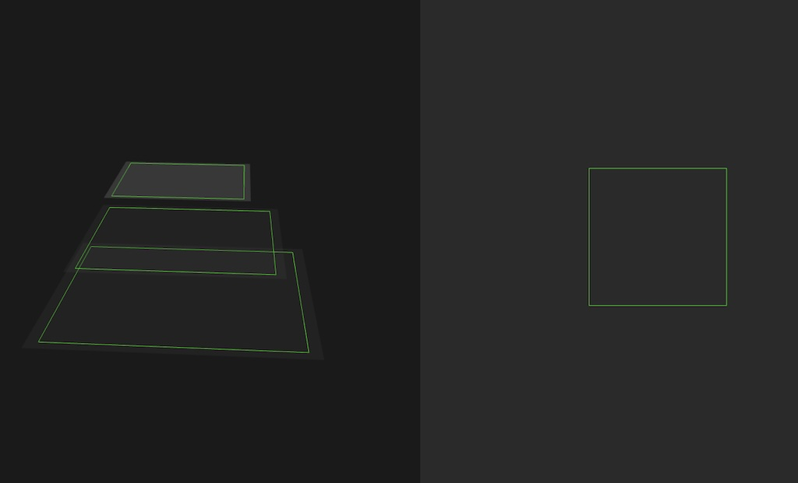
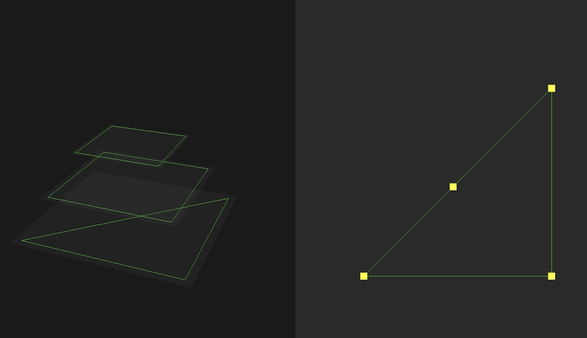
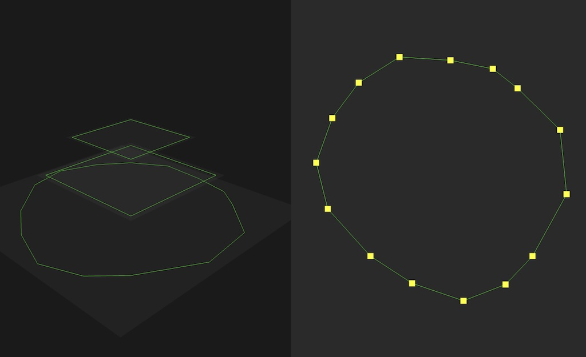
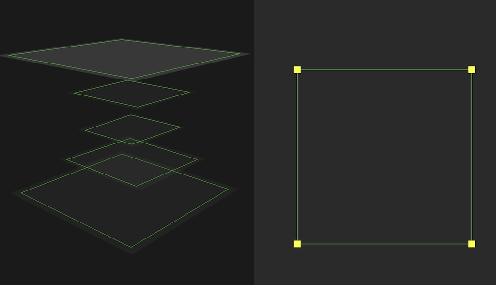
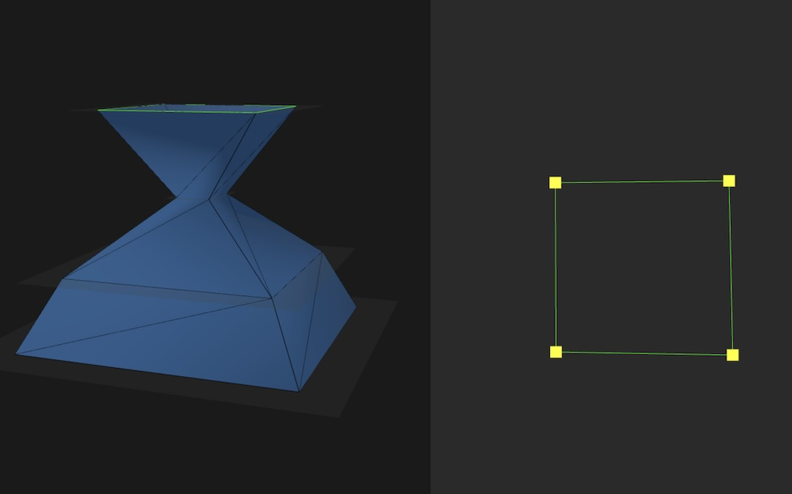
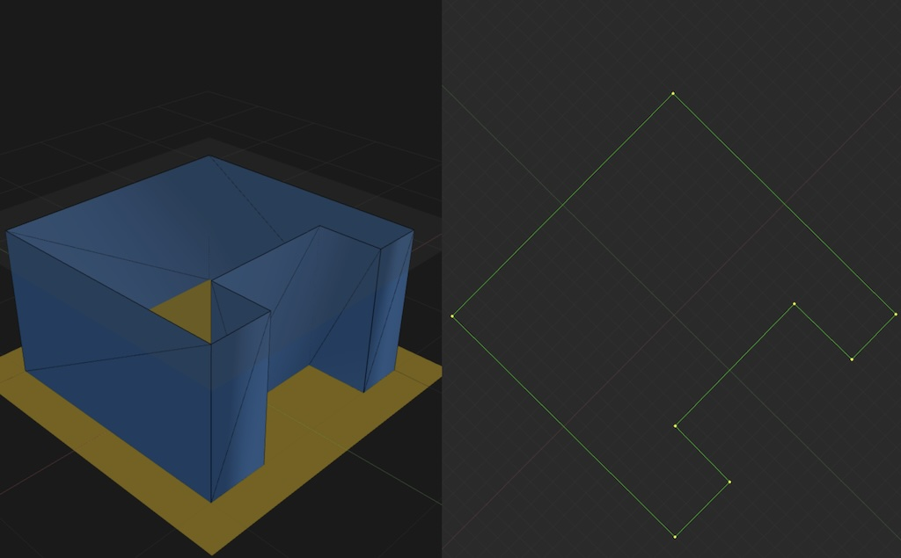
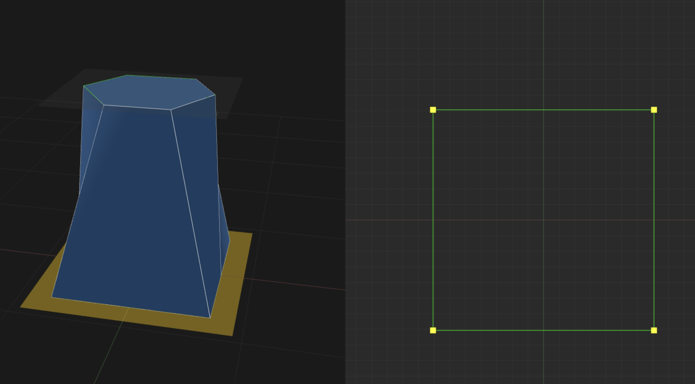
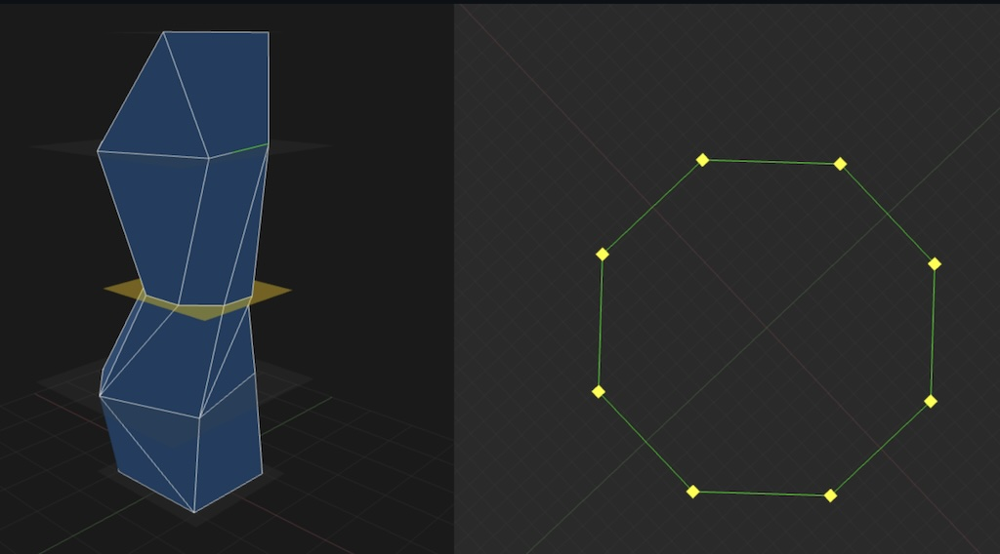

# AI Usage

I used ChatGPT during the planning phase and Claude Code during development.

I've been experimenting with Claude Code for several months so I knew it would
be the right tool for this task. I've made enough Claude Code mistakes, or mistakes
with AI in general, I've learned a pretty good flow:

1. Use Claude Code to generate the next step quickly.
2. Iterate until functional, if needed, make sure it works fully.
3. Periodically: examine the code closely and refactor by hand or with Claude Code.
4. Go to step 1.

Also commit often so if you make a change that doesn't work out you can easily
revert it. For this project I'm using branches like this:

1. `dev` is rapid iteration with Claude Code.
2. PRs into `main` only when well-understood and cleaned up.

# PRs

## Split Screen: 3D viewport on left, 2d sketch view on right ([PR #1](https://github.com/pwinston/maru/pull/1))
1. Initial split-screen view
2. 3D Viewport on the left for planes and loft
3. 2D Viewport on the right for editing sketches

## Three hard-coded planes with picking/selection ([PR #2](https://github.com/pwinston/maru/pull/2))
1. 3D view: show 3 hard-coded sketches, just different sized squares
2. 3D view: orbit controls + left-click for picking/selection 
3. Sketch view: shows the selected hard-coded sketch

## Simple sketch editing ([PR #3](https://github.com/pwinston/maru/pull/3))
1. Introduce `Sketch` class, the polygon itself
2. `SketchEditor` can now move vertices around
3. Add `Bounds` class as cleanup
4. Improve `PlaneSelector` and have 3 colors: normnal, hover, and selected

## Ability to Add and Delete vertexes ([PR #4](https://github.com/pwinston/maru/pull/4))
1. Modify `Sketch` and `SketchEditor` so we can add/delete vertices
2. Add mouse-wheel-zoom to `SketchEditor`

## Add, move and delete planes. Detect self-intersections. ([PR #5](https://github.com/pwinston/maru/pull/5))
1. 3D: Drag planes to move them in Z
2. 3D: Add planes by dragging base upward
3. 3D: Delete planes by dragging planes below ground, turns red, let go
4. 2D: Detect self-intersections, dragged vert turns red, drop red vert to delete
5. 2D: New `Geometry.ts` file

## Can create a simple loft! ([PR #6](https://github.com/pwinston/maru/pull/6))  
1. For now same number of vertices on all sketch
2. Option bar: None, Solid, Wireframe, Both

## 2D Sketch rotates, new help pane, grid, cleanup ([PR #7](https://github.com/pwinston/maru/pull/7))  
1. New grid, axes
2. Optionally rotate the 2D sketch as you orbit in 3D
3. Much more readable "help panel" to replace old "help bar"
4. Major cleanup of magic numbers into new `constants.ts` file

## Support a variable number of vertices! ([PR #8](https://github.com/pwinston/maru/pull/8))  
1. Support any number vertices on each plane, finds a correspondence
2. Click in empty space in 3D windows to deselect all planes
3. Move ui into new  `ui/MainToolbar.ts` and `ui/SketchToolbar.ts`
4. Optional roofs!
5. Display walls as triangles or quads
6. Add "instant shape" buttons for 3 through 100 sides

## Much better vertex correspondence: perimeter walk ([PR #9](https://github.com/pwinston/maru/pull/9))    
1. New better vertex correspondence: perimeter walk
2. Remove multi-loft-algorithm stuff, just use the one
3. Wireframe menu is now "On" or "Tris"
4. Tris shown in another color and dashed
